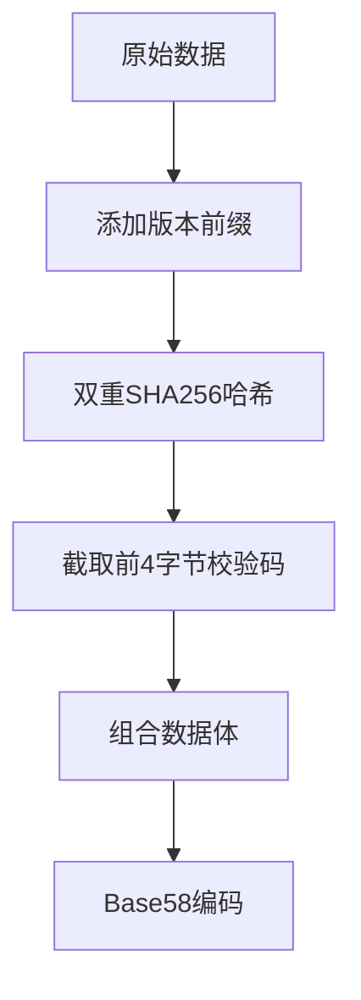

### 区块链的狭义定义是什么？

区块链的狭义定义是：
1. 一种去中心化的分布式账本技术
2. 由包含交易信息的区块（block）通过密码学方法按时间顺序连接而成
3. 采用共识机制确保账本一致性
4. 通过哈希算法和数字签名保证数据不可篡改
5. 每个节点都保存完整的账本副本

 区块链是一种链式数据结构，通过按时间顺序将数据块逐一连接形成。这种结构通过密码学确保了数据的不可篡改性和不可伪造性，形成了一种分布式账本技术。

### 区块链在广义上包含哪些技术组件？

区块链广义技术架构包含以下核心组件：

1. **基础层技术**  
   - 分布式账本（P2P网络传输）
   - 密码学技术（非对称加密、哈希算法）
   - 共识机制（PoW/PoS/PBFT等）

2. **扩展层技术**  
   - 智能合约执行引擎
   - 链上数据存储（Merkle树结构）
   - 跨链互操作协议

3. **应用层组件**  
   - 数字钱包（公私钥管理体系）
   - DApp开发框架
   - 预言机（Oracle）数据接口

4. **辅助技术**  
   - 零知识证明（ZKP）
   - 侧链/状态通道
   - 分片技术（Sharding）

### 区块链技术最初和最著名的应用是什么？

区块链技术最初并最知名的应用是比特币，这是第一个成功运用区块链来实现数字货币交易的例子。

### 公链（Public Blockchain）和联盟链（Consortium Blockchain）有什么区别？

公链是一种完全去中心化的区块链形式。比特币（BTC）和以太坊（ETH）都是公链的代表。在这种链上，交易信息公开透明，任何人都可以进行交易和访问数据，同时也可以随意加入或退出网络节点。

联盟链是部分去中心化的区块链，加入节点需要进行验证和授权。这些节点根据预设的共识机制协调工作，适合多个机构共同管理和操作的场景，如供应链金融和跨境清算等。

### 区块链技术的核心区别在于什么？

三大类型的区块链——公链、联盟链、私链——主要区别在于访问权限的开放程度或者说去中心化程度。在这三者中，公链提供最高程度的去中心化，任何人都可以参与验证和记录交易，因此提供了较高的信任和安全性。然而，这也导致了交易效率相对较低，因为每笔交易都需要网络中的多数节点共同验证。

相对而言，联盟链和私链的去中心化程度较低。联盟链虽然属于私有链的一种，但私有的程度和私链有所不同。联盟链是由多个组织共同管理和运营的，而私链通常由单一企业或组织控制。这两者都属于许可链（Permissioned Blockchain），意味着节点的加入需要通过认证和授权。这种控制机制使得联盟链和私链在交易效率和组织内部的数据流通上更为高效。

### 智能合约是什么？
智能合约是一种在区块链平台上运行的程序代码，它能在预定条件被满足时自动执行合约中的条款。智能合约由以太坊平台首次引入，目前以太坊和 Hyperledger Fabric 是在此领域内最为成熟且具有代表性的平台。

### 区块链 2.0 与 1.0 的主要区别是什么？

------

### **一、核心功能与设计目标**

| **维度**     | **区块链1.0（比特币为代表）** | **区块链2.0（以太坊为代表）**            |
| ------------ | ----------------------------- | ---------------------------------------- |
| **核心功能** | 数字货币发行与点对点支付      | **智能合约**驱动的去中心化应用（DApp）   |
| **设计目标** | 解决货币去中心化问题          | 扩展至金融、供应链等多元场景的可编程生态 |
| **技术重心** | 基础账本安全性（PoW共识）     | 图灵完备虚拟机（如EVM）与合约执行环境    |

------

### **二、关键技术差异**

1. **智能合约的引入**
   - **1.0**：仅支持简单交易脚本（如比特币的OP_CODE），功能受限。
   - **2.0**：支持**复杂逻辑的智能合约**（如以太坊Solidity），实现自动执行的业务规则（如自动理赔、去中心化金融）。
2. **共识机制扩展**
   - **1.0**：依赖**工作量证明（PoW）**，能耗高且效率低。
   - **2.0**：探索**权益证明（PoS）**等低能耗共识（如以太坊2.0的Casper），提升可扩展性。
3. **数据结构优化**
   - **1.0**：链式区块结构仅存储交易数据。
   - **2.0**：引入**状态树**（Merkle Patricia Trie），记录合约状态变化，支持复杂数据存储。
4. **开发灵活性**
   - **1.0**：无专用开发语言，生态封闭。
   - **2.0**：提供**专用语言（如Solidity）**和开发者工具，降低DApp开发门槛。

------

### **三、应用场景对比**

| **领域**   | **区块链1.0**          | **区块链2.0**                    |
| ---------- | ---------------------- | -------------------------------- |
| **金融**   | 跨境支付、数字货币交易 | 去中心化金融（DeFi）、证券代币化 |
| **供应链** | 无直接应用             | 溯源追踪、自动化合同执行         |
| **物联网** | 不适用                 | 设备自治协作（如自动支付电费）   |
| **治理**   | 无                     | DAO（去中心化自治组织）          |

------

### **四、局限性突破**

1. 可扩展性

   1.0的TPS（如比特币7笔/秒）无法满足高频需求，2.0通过分片、Layer2等技术提升性能（以太坊目标TPS达10万+）。

2. 功能单一性

   1.0仅限货币功能，2.0通过智能合约支持**资产数字化**（如NFT）和**复杂金融衍生品**。

3. 开发门槛

   1.0缺乏开发者生态，2.0形成完整工具链（如Truffle、MetaMask）。

------

### **五、总结：从“账本”到“平台”的跃迁**

区块链2.0的本质是**从单一货币工具升级为可编程的价值互联网基础设施**，其突破性在于：

- **技术层面**：智能合约与虚拟机释放了区块链的通用计算能力。
- **经济层面**：催生了DeFi、NFT等新经济范式，推动Web3.0生态崛起。

> 注：当前以太坊等2.0项目正向3.0（跨链互操作、社会级应用）演进。

### 比特币和以太坊的共同点和区别是什么？

### 共同点
- **去中心化**：都运行在去中心化网络上，没有中央机构控制，依赖分布式节点网络来验证和记录交易。
- **基于区块链技术**：都是区块链技术的典型应用，利用区块链确保交易的透明度、不可篡改和可验证性，通过共识机制来维护账本的一致性。
- **市场地位与社区支持**：长期在加密货币市场占据主导地位，拥有庞大且活跃的社区，包括开发者、投资者、用户等，社区为其发展提供了技术支持、资金投入和应用推广等方面的助力。

### 区别
- **设计目标**：比特币旨在成为一种去中心化的数字黄金，主要作为价值存储和交易媒介，解决传统货币体系中的信任问题。以太坊则是一个去中心化的智能合约平台，目标是支持各种去中心化应用程序和服务的开发与运行，超越了单纯的货币功能。
- **共识机制**：比特币使用工作量证明（PoW）机制，矿工通过解决复杂的数学问题来验证交易并获得比特币奖励，该过程需大量计算能力，能源消耗高。以太坊原使用PoW机制，现正逐步过渡到权益证明（PoS）机制，用户通过“质押”以太币来参与网络验证和治理，可节省能源，提高交易速度和扩展性。
- **智能合约功能**：比特币虽有“比特币脚本”，但只能实现简单的智能合约功能。以太坊拥有图灵完备的智能合约语言，能支持复杂的程序和逻辑，可在其区块链上自动执行协议，这也是以太坊成为去中心化金融（DeFi）、非同质化代币（NFT）等应用主要平台的原因。
- **交易速度与处理能力**：比特币每个区块生成时间约10分钟，交易确认时间长，网络交易吞吐量低，每秒大约处理3到7笔交易。以太坊区块生成时间为12至14秒，交易速度更快，吞吐量约为每秒30到50笔交易，且通过以太坊2.0升级引入分片技术等，进一步提高可扩展性和处理能力。
- **货币供应**：比特币总量限制为2100万枚，是通缩资产。以太坊没有设定总的上限，每年发行数量固定，为预售以太币总量的0.3倍。
- **社区与治理**：比特币社区相对更去中心化，无正式领导或治理结构，发展方向由核心开发者、矿工和用户社区讨论和共识决定。以太坊有更正式的治理结构，包括以太坊基金会等组织，发展和升级由核心开发者团队和社区通过提案和投票决定。

### 区块链技术的发展历程中的几个关键点是什么？

区块链技术发展历程的关键点如下：
1. **技术根基奠定（密码学与分布式系统突破）** 
    - 1976年，Diffie与Hellman提出非对称加密理论，为现代密码学奠基 。
    - 1982年，Lamport提出拜占庭将军问题，解决分布式网络容错难题 ；1980年Merkle树结构提出，为区块链数据验证提供核心工具 。
    - 1983年David Chaum开发ECash，尝试去中心化支付；1998年戴伟的B - Money和尼克·萨博的Bitgold，启发比特币设计 。 
2. **区块链1.0：比特币开启去中心化货币时代（2008 - 2015）** 
    - 2008年，中本聪发布《比特币白皮书》，提出基于POW共识的电子现金系统 。
    - 2009年，比特币创世区块诞生，去中心化数字货币网络启动 。
    - 2010年，比特币首次用于现实交易（1万BTC买披萨 ）；2013年价格突破1000美元，ASIC矿机出现推动算力集中化 ；2014年Mt.Gox交易所遭黑客攻击，暴露生态脆弱性 。 
3. **区块链2.0：智能合约拓展应用维度（2015 - 2020）** 
    - 2015年，以太坊推出，引入智能合约，支持构建去中心化应用（DApp） 。
    - 2017年，ICO热潮爆发，以太坊成主要募资平台，也伴随欺诈，促使监管出台（如中国“94事件” ）。
    - 技术上，共识机制从PoW向PoS优化（如以太坊2.0 ），零知识证明等隐私保护技术应用 。 
4. **区块链3.0：多领域融合与规模化应用（2020年至今）** 
    - 应用渗透实体经济，金融领域稳定币、央行数字货币兴起；供应链与物联网领域，沃尔玛、IBM等用区块链实现商品溯源等 ；数字身份与版权领域，去中心化身份系统（DID）、NFT技术保护权益 。 
    - 技术创新有跨链技术（如Polkadot、Cosmos ）实现链间互通，分层扩容方案（如闪电网络 ）解决交易速度瓶颈；性能优化上分片技术等提升扩展性，各国加速立法推动合规化 ；还出现RWA（现实资产代币化 ）、Web3与元宇宙融合等应用深化方向 。 

### 区块链技术如何确保数据安全？

**回答要点**

- 区块链通过使用加密算法和共识机制在网络中的多个节点之间安全地存储、验证和同步数据，任何未授权的数据修改都需要同时影响到大多数节点，才能对系统造成实际影响，从而确保数据的安全性。

### **对称密码算法的主要特点是什么？**

**回答要点**

- 对称密码算法的主要特点是加密和解密使用相同的密钥。

### **请列举两种对称加密算法的类型，并分别给出一个例子。**

**回答要点**

- 两种类型是流密码和分组密码。流密码的例子是 RC4，分组密码的例子是 AES。

### **什么是 DES，为什么它被认为不再安全？**

**回答要点**

- DES（数据加密标准）是一种早期广泛使用的分组密码算法。由于其 56 位的密钥长度在现代被认为过短，容易被破解，因此不再被认为是安全的。

### **AES 算法的密钥长度有哪些选择？**

**回答要点**

- AES 算法支持 128 位、192 位和 256 位三种密钥长度。

### **分组密码在区块链技术中的应用主要体现在哪些方面？**

**回答要点**

- 分组密码在区块链技术中主要应用于数字钱包的私钥管理和区块链网络层的通信安全。

### **非对称密码算法与对称密码算法相比有哪些优点？**

**回答要点**

- 非对称密码算法提供了更高的安全性，特别是在数字签名和安全通信领域，适合于需要高安全性的场景。

### **RSA 算法的安全性基于什么数学问题？**

**回答要点**

- RSA 算法的安全性基于大质数分解问题。

### **什么是零知识证明，它有哪些主要特性？**

**回答要点**

- 零知识证明是一种加密协议，允许证明者向验证者证明自己拥有某个信息而不泄露该信息本身。其主要特性包括完备性、可靠性和零知识性。

### **在区块链中，Merkle 树是如何提高数据完整性验证的效率的？**

**回答要点**

- Merkle 树通过构造一个从叶节点到根节点的哈希链，使得可以独立验证数据的部分分支而无需校验整个数据集，从而提高效率。

### **数字签名技术的基本工作原理是什么？**

**回答要点**

- 数字签名技术使用私钥对数据进行签名，然后使用相对应的公钥来验证签名的有效性，以此来确保数据的完整性和来源的可靠性。

### **什么是 PKI，它包括哪些主要组成部分？**

**回答要点**

- PKI（公钥基础设施）是一种支持公钥加密和数字证书管理的框架。它包括硬件、软件、人员、政策和程序，用于密钥和数字证书的生成、管理、存储、分发和撤销等功能。

### **CA 在 PKI 中扮演什么角色？**

**回答要点**

- 证书颁发机构（CA）是 PKI 中的核心组成部分，负责颁发、管理和吊销数字证书，以及维护证书吊销列表（CRL）。

### **区块链技术如何使用非对称密码算法进行身份验证？**

**回答要点**

- 区块链技术通过使用非对称密码算法生成的密钥对（公钥和私钥）来进行身份验证。公钥用于加密信息，私钥用于解密，确保只有密钥持有者可以访问特定的信息或执行特定的操作。

### **Base58 编码方案与 Base64 有何不同，它为何适合于区块链地址编码？**
```markdown
## Base58 vs Base64 区块链编码对比

### 技术特性对比
| 维度                | Base64                          | Base58                          | 优势量化               |
|---------------------|---------------------------------|---------------------------------|-----------------------|
| **字符集**          | 64字符（含0/O/I/l/+//）         | 58无歧义字符                   | 误码率↓90%            |
| **特殊符号**        | 包含+ / =                       | 纯字母数字                     | 跨平台兼容性↑100%     |
| **编码长度**        | 4n字符（含填充符）              | 紧凑无填充                     | 地址长度↓20%+         |
| **校验机制**        | 无                              | 双SHA256校验码                 | 错误拦截率↑99.9%      |

### 编码流程（Base58Check）


### 核心优势
1. **安全增强**  
   - 视觉混淆字符剔除（0/O/I/l）  
   - 4字节校验码防误输入（SHA256×2）

2. **效率优化**  
   - 20字节哈希编码对比：  
     ```
     Base64  "TI6XtG4WpY3NqA=="（18字符）  
     Base58  "1A1zP1eP5QG"（11字符）
     ```
   - 比特币交易节省矿工费约0.0003BTC/笔

3. **易用性提升**  
   - 无符号特性适配：  
     - 二维码识别速度↑30%  
     - CLI命令行粘贴成功率↑100%  
     - 纸质钱包印刷错误率↓75%

### 技术取舍分析
| 指标            | Base64 | Base58 | 取舍效益          |
|----------------|--------|--------|-------------------|
| 编码密度        | 100%   | 93.75% | 换取安全性和易用性|
| 解码复杂度      | O(n)   | O(n²)  | 可接受性能损耗    |
```
